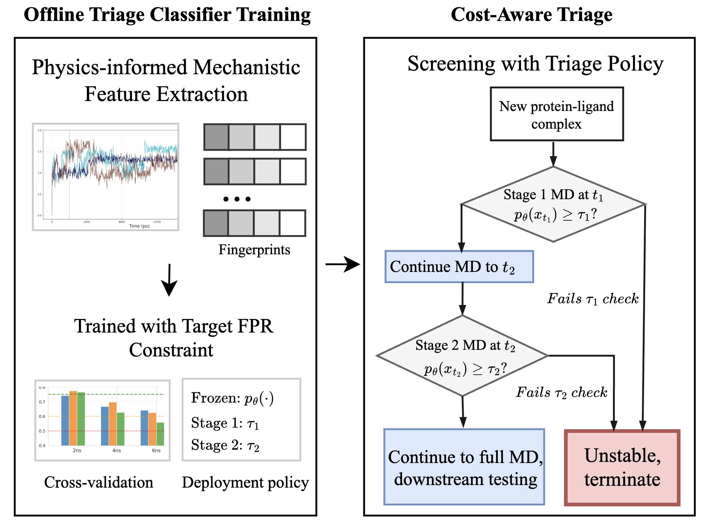

# A Physics-Informed Machine Learning Framework for Screening Antifungal Resistance-Mediating ABC Transporter Pocket Stability

Antifungal drug resistance is a growing global health threat, driven in part by ATP-binding cassette (ABC) efflux transporters that expel drugs from the fungal cell. Evaluating ligand binding stability within protein pockets typically requires long molecular dynamics (MD) simulations, limiting scalability due to the high computational cost of MD.

This repository implements a **physics-informed** early-termination framework that computes mechanistic fingerprints from short MD windows, capturing pocket RMSD drift and variance with Cα displacement information, and trains lightweight models to predict long-timescale instability.



Rather than replacing long MD, the framework is designed as a false-positive-rate (FPR)-calibrated triage layer that conserves computational resources while accelerating screening. Across 72 ligand-binding pockets from 16 transporters, early MD windows support termination decisions using thresholds calibrated within training folds to target a nominal training-fold FPR constraint. Achieved FPR on held-out proteins is reported to quantify realized deployment risk, and at permissive operating points, the triage policy achieves recall up to 60% and yields **30-40% computational cost savings**, with stable complexes proceeding to further testing.

---

## Table of Contents

1. [Overview](#overview)
2. [Key Features](#key-features)
3. [Installation](#installation)
4. [Data Requirements](#data-requirements)
5. [Pipeline Architecture](#pipeline-architecture)
6. [Usage](#usage)
7. [Mechanistic Fingerprints](#mechanistic-fingerprints)
8. [Cross-Validation Strategies](#cross-validation-strategies)
9. [Output Files](#output-files)
10. [Citation](#citation)

---

## Overview

The framework addresses a fundamental bottleneck in computational drug discovery: the high cost of running long molecular dynamics simulations to assess ligand binding stability. Our approach extracts **4-dimensional mechanistic fingerprints** from short (1–14 ns) MD simulations and uses machine learning to predict whether a ligand–pocket complex will remain stable over the full 20 ns trajectory.

**Key insight**: Early-time dynamics contain informative signals about long-term stability. By identifying unstable complexes early, we can terminate simulations before the full 20 ns, achieving substantial computational savings without sacrificing screening accuracy for stable binders.

---

## Key Features

- **Physics-informed fingerprints**: Extracts interpretable mechanistic features from MD trajectories (RMSD slope, variance, Cα displacements)
- **FPR-calibrated triage**: Operating thresholds are calibrated to control false positive rate, ensuring stable complexes are not prematurely terminated
- **Multiple CV strategies**: Supports Leave-One-Protein-Out (LOPO) and GroupKFold cross-validation for rigorous generalization assessment
- **Configurable time windows**: Accumulated or sliding window modes for fingerprint extraction
- **Cost-efficiency analysis**: Quantifies computational savings at different operating points
- **Publication-ready figures**: Automated generation of ROC curves, PR curves, timescale horizon plots, and triage efficiency visualizations

---

## Installation

### Prerequisites

- Python 3.9+
- MDAnalysis for trajectory processing
- scikit-learn for machine learning
- matplotlib/seaborn for visualization

### Setup

```bash
# Clone the repository
git clone https://github.com/yourusername/physicsinformedtriage.git
cd physicsinformedtriage

# Create conda environment
conda create -n mdtriage python=3.10
conda activate mdtriage

# Install dependencies
pip install -r requirements.txt
```

### Dependencies

```
numpy>=1.21.0
pandas>=1.3.0
matplotlib>=3.4.0
seaborn>=0.11.0
scikit-learn>=1.0.0
MDAnalysis>=2.0.0
```

---

## Data Requirements

### Directory Structure

The pipeline expects MD simulation data organized as follows:

```
simulation_20ns_md/
├── PROTEIN_ID/
│   └── simulation_explicit/
│       ├── pocket1/
│       │   └── replica_1/
│       │       ├── *_initial_frame.pdb          # Topology
│       │       ├── *_trajectory.dcd             # Full trajectory
│       │       ├── *_stripped_initial_frame.pdb # For drift calculation
│       │       ├── *_stripped_final_frame.pdb
│       │       ├── fingerprints_ca_4/           # Output fingerprints
│       │       │   ├── fingerprint_2ns.npy
│       │       │   ├── fingerprint_4ns.npy
│       │       │   └── ...
│       │       └── reduced/                     # Optional: reduced trajectory
│       │           ├── reduced_topology.pdb
│       │           └── reduced_trajectory.xtc
│       ├── pocket2/
│       └── ...
├── ANOTHER_PROTEIN/
└── ...
```

### Required Input Files

1. **Trajectory files**: DCD or XTC format with corresponding topology PDB
2. **PrankWeb predictions**: Pocket residue definitions in CSV format at `mutation_pipeline/outputs/prank/{PROTEIN}_relaxed.pdb_predictions.csv`
3. **Ground truth labels**: Stability labels computed from 20 ns simulations

---

## Pipeline Architecture

The pipeline consists of four main stages:

### 1. Ground Truth Label Computation (`compute_ground_truth_labels.py`)

Computes stability labels from full 20 ns simulations using multiple criteria:

- **Contact persistence (f_contact)**: Fraction of protein–ligand contacts retained
- **RMSD late**: Median ligand RMSD over the last 30% of trajectory
- **Ligand drift**: COM displacement from initial to final frame

A pocket is labeled **unstable** if:
- f_contact ≤ 0.35, OR
- rmsd_late ≥ 1.0 Å, OR
- ligand_drift ≥ 6.0 Å (when RMSD unavailable)

```bash
python compute_ground_truth_labels.py --base-root ~/simulation_20ns_md/ --proteins AFR1 CDR1_CANAR ...
```

### 2. Fingerprint Generation (`generate_timescale_fingerprints.py`)

Extracts 4D mechanistic fingerprints from MD trajectories at multiple timescales:

```bash
python generate_timescale_fingerprints.py
```

**Configuration options**:
- `TIMESCALES`: List of evaluation timepoints (default: [1, 2, 3, 4, 5, 6, 7, 8, 10, 12, 14] ns)
- `WINDOW_MODE`: "accumulated" (0 to T) or "sliding" (T-W to T)
- `WINDOW_SIZE_NS`: Window size for sliding mode

### 3. Fingerprint Aggregation (`generate_fingerprint_summary.py`)

Combines fingerprints across all proteins/pockets into a single CSV for model training:

```bash
python generate_fingerprint_summary.py
```

Output: `fingerprint_summary_with_components_even_ac_4d_drift_{DATE}.csv`

### 4. Model Training and Evaluation (`generate_figure_both_cv_ligand.py`)

Trains and evaluates ML models with rigorous cross-validation:

```bash
python generate_figure_both_cv_ligand.py \
    --features dataset/fingerprint_summary_with_components_even_ac_4d_drift_20251225.csv \
    --output comprehensive_ml_both_cv.png \
    --group_by both
```

---

## Mechanistic Fingerprints

The 4D fingerprint captures pocket dynamics through interpretable physical quantities:

| Feature | Description | Physical Interpretation |
|---------|-------------|------------------------|
| `slope` | Linear regression slope of pocket RMSD vs. time | Rate of structural drift |
| `rmsd_var` | Variance of pocket RMSD over time window | Conformational flexibility |
| `mean_disp` | Mean per-frame Cα displacement | Average atomic mobility |
| `var_disp` | Variance of Cα displacements | Heterogeneity of motion |

### Fingerprint Computation

For each timescale T:

1. **Extract trajectory window**: [0, T] (accumulated) or [T-W, T] (sliding)
2. **Compute pocket RMSD**: Per-frame RMSD of pocket Cα atoms vs. reference
3. **Fit RMSD trend**: Linear regression gives slope
4. **Compute displacements**: Frame-to-frame Cα movements
5. **Aggregate statistics**: Mean, variance of displacements

```python
fingerprint = np.array([
    slope,      # RMSD drift rate
    rmsd_var,   # RMSD fluctuation
    mean_disp,  # Average Cα mobility
    var_disp    # Mobility heterogeneity
])
```

---

## Cross-Validation Strategies

The framework implements two complementary CV strategies:

### Leave-One-Protein-Out (LOPO)

- **Group by**: Protein ID
- **Purpose**: Tests generalization to entirely new proteins
- **Use case**: Deploying model on novel transporter families

```python
CV_SETTINGS["protein"] = {
    "group_by": "protein",
    "cv_mode": "logo",
    "label": "Cross-protein (LOPO)"
}
```

### GroupKFold (Pocket-level)

- **Group by**: protein|ligand|pocket
- **Purpose**: Tests generalization to new pockets within known proteins
- **Use case**: Screening new binding sites on characterized transporters

```python
CV_SETTINGS["pocket"] = {
    "group_by": "pocket",
    "cv_mode": "gkf",
    "label": "Cross-pocket (protein|pocket)"
}
```

---

## Usage

### Quick Start

```bash
# 1. Compute ground truth labels (run once)
python compute_ground_truth_labels.py \
    --base-root ~/simulation_20ns_md/ \
    --proteins AFR1 CDR1_CANAR CDR2_CANAL ... \
    --output label_drift_20ns.csv \
    --use-plip

# 2. Generate fingerprints at multiple timescales
python generate_timescale_fingerprints.py

# 3. Aggregate fingerprints into training dataset
python generate_fingerprint_summary.py

# 4. Train models and generate figures
python generate_figure_both_cv_ligand.py \
    --features dataset/fingerprint_summary_with_components_even_ac_4d_drift_20251225.csv \
    --output comprehensive_ml_both_cv.png \
    --group_by both
```

### Generate All Figures

```bash
python plot_all_figures.py
```

This generates:
- Panel B: Cost savings vs. simulation length
- Comprehensive ML comparison figure
- Timescale horizon plot
- Triage efficiency visualization
- Early time separation analysis

---

## Output Files

### Data Files

| File | Description |
|------|-------------|
| `label_drift_20ns.csv` | Ground truth stability labels |
| `fingerprint_summary_with_components_*.csv` | Aggregated fingerprints for all pockets |
| `results_both_cv_*.pkl` | Pickled model results for reproducibility |
| `screening_report_both_cv_*.csv` | Screening metrics at all operating points |

### Figures

| Figure | Description |
|--------|-------------|
| `comprehensive_ml_both_cv_*.png` | 6-panel model comparison |
| `figure1_timescale_horizon_*.png` | AUC vs. simulation time |
| `figure2_triage_efficiency_*.png` | Recall vs. cost savings trade-off |
| `panel_b_cost_savings_*.png` | Computational savings analysis |
| `early_time_separation_2ns_*.png` | Feature distributions by stability class |

### Tables

| File | Description |
|------|-------------|
| `table_iii_operating_points_*.csv` | Recommended operating points |
| `table_iii_operating_points_*.tex` | LaTeX-formatted table for publication |

---

## Models

The framework evaluates three classifiers:

| Model | Configuration |
|-------|--------------|
| **Logistic Regression** | C=3, balanced class weights |
| **Random Forest** | 300 trees, max_depth=8, min_samples_split=3 |
| **Gradient Boosting** | 300 estimators, max_depth=3, learning_rate=0.03 |

Logistic Regression typically performs best due to the low-dimensional feature space and provides interpretable coefficients.

---

## Operating Point Selection

The framework provides FPR-calibrated operating points for deployment:

| Mode | Timescale | FPR Target | Use Case |
|------|-----------|------------|----------|
| Conservative | 7 ns | ≤10% | High-value compounds, minimize false positives |
| Balanced | 3 ns | ≤20% | Standard screening |
| Aggressive | 2 ns | ≤20% | Large-scale initial triage |

**Cost savings formula**:
```
cost_saved = triage_rate × (20 - T) / 20
```

Where `triage_rate` is the fraction of complexes predicted unstable (terminated early).

---

## Project Structure

```
physicsinformedtriage/
├── pipeline/
│   ├── sim/
│   │   ├── processor.py           # MD trajectory analysis
│   │   └── domain_cfg.py          # Protein domain configurations
│   ├── training/
│   │   ├── compute_ground_truth_labels.py
│   │   ├── generate_timescale_fingerprints.py
│   │   ├── generate_fingerprint_summary.py
│   │   ├── generate_figure_both_cv_ligand.py
│   │   ├── plot_all_figures.py
│   │   └── dataset/
│   │       └── fingerprint_summary_*.csv
│   ├── features/
│   │   └── mechanical.py          # Feature computation utilities
│   ├── io/
│   │   ├── prankweb.py           # Pocket residue loading
│   │   └── gff.py                # DeepTMHMM parsing
│   └── config.py                  # Project paths
├── README.md
├── system_diagram.png
└── requirements.txt
```

---

## Proteins Included

The framework was validated on 16 fungal ABC transporters:

| Protein | Organism | Pockets |
|---------|----------|---------|
| AFR1 | *A. fumigatus* | 4 |
| ATRF_ASPFU | *A. fumigatus* | 5 |
| CDR1_CANAR | *C. auris* | 4 |
| CDR2_CANAL | *C. albicans* | 5 |
| CIMG_00533 | *C. immitis* | 4 |
| CIMG_00780 | *C. immitis* | 5 |
| CIMG_01418 | *C. immitis* | 4 |
| CIMG_06197 | *C. immitis* | 5 |
| CIMG_09093 | *C. immitis* | 4 |
| MDR1_CRYNH | *C. neoformans* | 5 |
| MDR1_TRIRC | *T. rubrum* | 4 |
| MDR2_TRIRC | *T. rubrum* | 5 |
| PDR5_YEAST | *S. cerevisiae* | 4 |
| PDH1_CANGA | *C. glabrata* | 5 |
| SNQ2_CANGA | *C. glabrata* | 5 |

**Total**: 72 ligand-binding pockets across diverse fungal pathogens

---

[//]: # (## Citation)

[//]: # ()
[//]: # (If you use this framework in your research, please cite:)

[//]: # ()
[//]: # (```bibtex)

[//]: # (@article{physicsinformedtriage2026,)

[//]: # (  title={A Physics-Informed Machine Learning Framework for Screening )

[//]: # (         Antifungal Resistance-Mediating ABC Transporter Pocket Stability},)

[//]: # (  author={...},)

[//]: # (  journal={IEEE Engineering in Medicine and Biology Society},)

[//]: # (  year={2026})

[//]: # (})

[//]: # (```)

---

## License

This project is licensed under the MIT License - see the [LICENSE](LICENSE) file for details.

---

## Acknowledgments

- PrankWeb for pocket prediction
- MDAnalysis development team
- PLIP for protein–ligand interaction profiling
