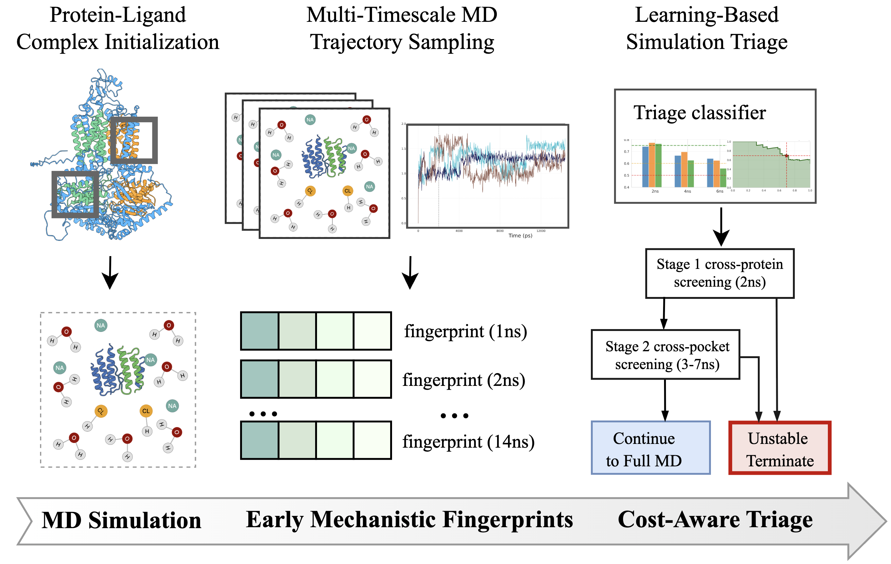

# A Physics-Informed Machine Learning Framework for Screening Antifungal Resistance-Mediating ABC Transporter Pocket Stability
Antifungal drug resistance is a growing global health threat, driven in part by ATP-binding cassette (ABC) efflux transporters that expel drugs from the fungal cell. Evaluating ligand binding stability within protein pockets typically requires long molecular dynamics (MD) simulations, limiting scalability due to the high computational cost of MD.
This repository implements a **physics-informed** early-termination framework that computes mechanistic fingerprints from short MD windows, capturing pocket RMSD drift and variance with C$\alpha$ displacement information, and trains lightweight models to predict long-timescale instability.

 Rather than replacing long MD, the framework is designed as a false-positive-rate (FPR)-calibrated triage layer that conserves computational resources while accelerating screening. Across 72 ligand-binding pockets from 16 transporters, early MD windows support termination decisions using thresholds calibrated within training folds to target a nominal training-fold FPR constraint. Achieved FPR on held-out proteins is reported to quantify realized deployment risk, and at permissive operating points, the triage policy achieves recall up to 60\% and yields 30-40\% computational cost savings, with stable complexes proceeding to further testing. By enabling scalable screening of pocket stability using short MD and leveraging informative early-time signals, this framework accelerates cost-effective antifungal drug discovery efforts against resistance.

